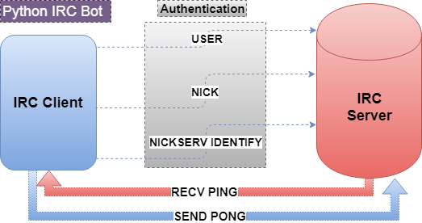

## IRC Bot
IRC ***[Internet Relay Chat]*** is a application layer protocol used for exchanging messages over the internet.

<p align="center">
  
</p>

This is my implementation of the IRC Bot using ***Twisted***. It duplicates human interaction through automation and lists quotes from its directory when prompted by another user. 

It also includes the following functionalities:
1. Unit Testing using the ```unittest``` module. 
2. Logging messages at all levels using the ```log``` module.
3. Portability over different applications.

### settings.ini
Here, ```freenode.net``` is chosen as the ***IRC Network***.
```python
[irc]
endpoint = ssl:host=irc.freenode.net:port=7000
nickName = sid_jpr
realName = bot: list quotes

channel = #cs_apachi

[talkback]
quotesFilename = quotes/quotes1.txt
triggers =
    quotes
    quotations
    list quotes
    list quotations
```
